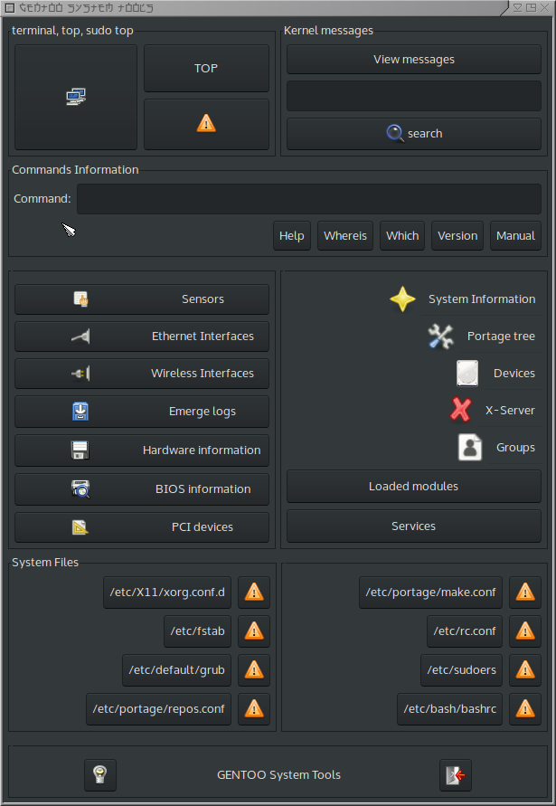

# gtkdialog gentoo-systemtools
gtkdialog gentoo-systemtools

Based on: https://pclosmag.com/html/Issues/200910/page21.html

# Screenshot

# Depends ...
  * gtkdialog
  * xterm
  * sudo -A
    x11-ssh-askpass/ssh-askpass-fullscreen or equivalent must be installed and configured
  * vim|nano

# What's changed
  * Repurposed from PCLinuxOS to gentoo
  * Lost zenity in favor of the first available terminal editor
  * Lost multiple gtkdialog button action tags, for concurrencies sake
  * Lost various temp files for a central exported temp file.

# Yes but ...Why?
  * coz... reasons...
  * Why not?
  * Convenience.
  * To fiddle with gtkdialog.
  * For central {hard,soft}ware reporting.
  * For direct access to troubleshooting information.
  * As a collection of various gentoo configuration files and reporting tools.
